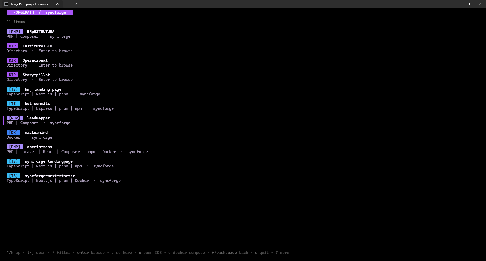

[](README.md) [](README.pt-BR.md)

# ForgePath

ForgePath is an interactive terminal application for discovering, navigating, and managing software projects from a single interface.

Built with Go, ForgePath scans configured workspaces, identifies projects and their main technologies, and provides shortcuts for common development actions such as opening a project, starting its development environment, checking Git information, and launching it in an editor.

> ForgePath is currently under development.

## Overview

Developers often keep multiple projects across different folders, technologies, and environments. Navigating between them usually requires remembering paths, repeating commands, and manually checking how each project should be started.

ForgePath centralizes this workflow in an interactive terminal interface.



*A quick demonstration of ForgePath in action, including project navigation and Docker Compose generation.*

## Goals

ForgePath is being developed as both a practical developer tool and a study project focused on:

* Go fundamentals
* Terminal user interfaces
* Filesystem traversal
* Process execution
* Shell integration
* Cross-platform development
* Project and framework detection
* Software architecture
* Configuration management
* Testing and release automation

## Features

### Project discovery

* Scan multiple configured workspaces
* Detect projects through manifest and configuration files
* Ignore generated and dependency directories
* Cache detected projects for faster startup

### Technology detection

ForgePath detects projects from the following ecosystems:

* JavaScript and TypeScript
* PHP
* Java
* Python
* Go
* Rust
* Ruby
* Swift
* Elixir

Supported frameworks and tools include:

* Next.js
* React
* Vue.js
* Nuxt
* NestJS
* Express
* Laravel
* Spring Boot
* FastAPI
* Docker
* Docker Compose

### Interactive terminal interface

* Search projects using fuzzy filtering
* Navigate with the arrow keys while rendering only the visible projects
* Browse project directories without leaving the terminal interface
* Render the embedded Devicon technology logos with ANSI truecolor pixels
* Show the current Git branch
* Indicate uncommitted changes
* Display recent and favorite projects
* Provide colored text badges and Nerd Font glyphs as fallback modes
* Detect installed IDEs and rank suggestions for each project technology

### Project actions

* Choose between compatible installed IDEs from inside the selector
* Open the project directory
* Start the development environment
* Execute custom project commands

### Shell integration

ForgePath integrates with shells such as PowerShell and Bash. Browsing and opening IDEs stay inside the application; the shell directory changes only when the user presses `c`.

```powershell
fg
```

After pressing `c`, the shell navigates to the directory currently displayed in ForgePath.

## Tech Stack

* [Go](https://go.dev/)
* [Bubble Tea](https://github.com/charmbracelet/bubbletea)
* [Bubbles](https://github.com/charmbracelet/bubbles)
* [Lip Gloss](https://github.com/charmbracelet/lipgloss)
* [Cobra](https://github.com/spf13/cobra)
* Nerd Fonts

## Architecture

The project is organized into isolated modules so that terminal rendering, project detection, configuration, filesystem access, and process execution remain independent.

```text
forgepath/
├── cmd/
│   └── fg/
│       └── main.go
│
├── internal/
│   ├── cli/
│   ├── config/
│   ├── detector/
│   ├── project/
│   ├── action/
│   ├── git/
│   ├── icon/
│   ├── ide/
│   ├── platform/
│   └── tui/
│
├── public/
│   └── icons/
│       └── *.svg
│
├── go.mod
├── go.sum
├── LICENSE
└── README.md
```

### Main modules

| Module     | Responsibility                                            |
| ---------- | --------------------------------------------------------- |
| `cli`      | Commands, flags, aliases, and shell-facing output         |
| `config`   | Configuration loading, validation, and default paths      |
| `detector` | Language, framework, package manager, and tool detection  |
| `project`  | Project scanning, indexing, and domain models             |
| `action`   | Safe execution of project commands                        |
| `git`      | Branch, repository, remote, and working tree information  |
| `icon`     | Nerd Font icons and ASCII fallbacks                       |
| `ide`      | Installed IDE discovery and technology-aware ranking      |
| `platform` | Operating system-specific behavior                        |
| `tui`      | Terminal state, events, keyboard shortcuts, and rendering |

## Project Detection

ForgePath detects projects through marker files and dependency manifests.

| Ecosystem               | Marker files                                       |
| ----------------------- | -------------------------------------------------- |
| JavaScript / TypeScript | `package.json`, `tsconfig.json`                    |
| PHP                     | `composer.json`, `artisan`                         |
| Java                    | `pom.xml`, `build.gradle`, `build.gradle.kts`      |
| Python                  | `pyproject.toml`, `requirements.txt`, `Pipfile`    |
| Go                      | `go.mod`, `go.work`                                |
| Rust                    | `Cargo.toml`                                       |
| Ruby                    | `Gemfile`                                          |
| Swift                   | `Package.swift`                                    |
| Elixir                  | `mix.exs`                                          |
| Docker                  | `Dockerfile`, `compose.yaml`, `docker-compose.yml` |

Frameworks are identified by inspecting project dependencies and configuration files.

For example:

```text
next                 → Next.js
@nestjs/core         → NestJS
vue                  → Vue.js
laravel/framework    → Laravel
spring-boot          → Spring Boot
fastapi              → FastAPI
```

Directories such as the following will be ignored during project analysis:

```text
.git
.idea
.vscode
node_modules
vendor
.next
dist
build
target
.venv
venv
__pycache__
coverage
```

## Configuration

ForgePath uses a user configuration file for global workspaces, editor preferences, and project commands.

Example:

```json
{
  "workspaces": ["D:\\Development", "D:\\Clients"],
  "editor": {
    "name": "phpstorm",
    "executable": "phpstorm64.exe"
  },
  "projects": {
    "story-pilot": {
      "command": ["node", "node_modules/vite/bin/vite.js"]
    },
    "operis": {
      "command": ["php", "composer.phar", "dev"]
    },
    "mastermind": {
      "command": ["docker", "compose", "up"]
    }
  }
}
```

Expected configuration paths:

```text
Windows: %APPDATA%\forgepath\config.json
Linux:   ~/.config/forgepath/config.json
macOS:   ~/Library/Application Support/forgepath/config.json
```

## Commands

First, add one or more folders that contain your projects. This global catalog lets ForgePath work from any current directory:

```bash
fg workspace add D:\Development
fg workspace add D:\Clients
fg workspace list
```

```bash
fg
```

Open the persistent terminal browser. Browsing projects, entering subdirectories, returning to parents, searching, and launching an IDE all happen without stopping ForgePath.

The IDE chooser verifies installed executables before showing them and ranks technology-specific tools first. For example, a PHP project suggests PhpStorm before Visual Studio Code when both are installed; TypeScript prefers WebStorm, Python prefers PyCharm, Go prefers GoLand, Java prefers IntelliJ IDEA, and Rust prefers RustRover.

### IDE discovery

| Technology | Preferred IDE | Compatible fallback |
| --- | --- | --- |
| PHP | PhpStorm | Visual Studio Code, Cursor, Zed, Sublime Text |
| TypeScript / JavaScript | WebStorm | Visual Studio Code, Cursor, Zed, Sublime Text |
| Python | PyCharm | Visual Studio Code, Cursor, Zed, Sublime Text |
| Go | GoLand | Visual Studio Code, Cursor, Zed, Sublime Text |
| Java | IntelliJ IDEA | Visual Studio Code, Cursor, Zed, Sublime Text |
| Rust | RustRover | Visual Studio Code, Cursor, Zed, Sublime Text |
| Ruby | RubyMine | Visual Studio Code, Cursor, Zed, Sublime Text |
| Swift | Xcode | Visual Studio Code, Cursor, Zed, Sublime Text |
| Elixir / Docker | Visual Studio Code | Cursor, Zed, Sublime Text |

ForgePath checks `PATH` and common installation locations. Detection covers standalone and JetBrains Toolbox installations on Windows, `/Applications`, user applications, and Toolbox on macOS, and `PATH`, Toolbox, Snap, and Flatpak on Linux. Editors that are missing or incompatible with the detected technology are not shown.

### Keyboard controls

| Key | Action |
| --- | --- |
| `↑` / `↓` | Move through the visible projects, directories, or IDEs |
| `/` | Search the current list by name or technology |
| `Enter` | Enter the selected project/directory, or launch the selected IDE |
| `Backspace` / `←` | Return to the parent directory or project list without closing ForgePath |
| `o` | Show compatible IDEs that were verified as installed |
| `c` | Close ForgePath and change the shell to the directory currently displayed |
| `Esc` | Close search or return to the previous internal screen |
| `q` / `Ctrl+C` | Quit without changing the shell directory |

When an IDE is launched, ForgePath returns to the directory browser and stays open. Generated directories such as `.git`, `node_modules`, `vendor`, `target`, `dist`, and `build` are omitted from the internal browser.

```bash
fg list
```

List all detected projects.

```bash
fg scan
```

Scan a workspace and rebuild its project cache. `fg`, `list`, and `pick` reuse cache entries for up to 30 seconds; pass `--refresh` to bypass them.

```bash
fg pick --print-path
```

Browse projects and print the current directory only after `c` is pressed. This machine-readable output is used by the shell integration.

The selector embeds the local Devicon SVGs in the binary, rasterizes them, and renders their real colors with ANSI half-block pixels by default. This does not require a Nerd Font or a terminal-specific image protocol. Use text badges or Nerd Font glyphs explicitly when preferred:

```bash
fg --icons ascii
fg pick --icons nerd-font
fg --icons nerd-font
```

The pinned Devicon v2.17.0 assets and license are stored in `public/icons`. `go:embed` packages them into `fg`, while `oksvg` and `rasterx` perform the in-memory rasterization. No network access is required at runtime.

```bash
fg open <project> [workspace] --editor <executable>
```

Open a project in an editor. Set an executable with `--editor` or `FORGEPATH_EDITOR`.

On Windows, provide the editor `.exe` path rather than a `.cmd` or `.bat` launcher.

```bash
fg reveal <project> [workspace]
```

Reveal a project in Explorer, Finder, or the Linux file manager.

```bash
fg run <project> [workspace]
```

Run the development command configured for a project. Commands are argument arrays and are never interpreted by a shell.

On Windows, `.cmd` and `.bat` launchers are rejected. Configure a real `.exe` or invoke a script through its interpreter, such as `node.exe` or `php.exe`.

```bash
fg config init
```

Create an initial configuration file.

Use `--config <path>` or `FORGEPATH_CONFIG` to override the default configuration path.

```bash
fg favorite add <project> [workspace]
fg favorite remove <project> [workspace]
fg favorite list
fg recent
```

Favorites are shown first in the selector, followed by recently used projects. Use `--state <path>` or `FORGEPATH_STATE` to override the state file location.

Use `--cache <directory>` or `FORGEPATH_CACHE` to override the project cache location.

```bash
fg completion powershell
```

Generate shell completion scripts.

## PowerShell Integration

A shell function is required because a child process cannot directly change the working directory of its parent shell.

The intended PowerShell integration is:

```powershell
function fg {
    if ($args.Count -eq 1 -and $args[0] -in @("back", "-")) {
        if ((Get-Location -Stack -ErrorAction SilentlyContinue).Count -eq 0) {
            Write-Error "ForgePath has no previous directory"
            return
        }
        try {
            Pop-Location -ErrorAction Stop
        }
        catch {
            Write-Error "ForgePath has no previous directory"
        }
        return
    }

    $commands = @("list", "pick", "scan", "open", "reveal", "run", "config", "workspace", "favorite", "recent", "completion", "help")
    $dispatch = $false
    $expectValue = $false
    foreach ($argument in $args) {
        if ($expectValue) {
            $expectValue = $false
            continue
        }
        if ($argument -in @("--config", "--state", "--cache", "--icons")) {
            $expectValue = $true
            continue
        }
        if ($argument -match '^--(config|state|cache|icons)=') {
            continue
        }
        if ($argument -in @("-h", "--help", "--version")) {
            $dispatch = $true
            break
        }
        if ($argument.StartsWith("-")) {
            continue
        }
        if ($commands -contains $argument) {
            $dispatch = $true
        }
        break
    }
    $applicationName = if ($env:OS -eq "Windows_NT") { "fg.exe" } else { "fg" }
    $executable = @(Get-Command $applicationName -CommandType Application -ErrorAction Stop)[0].Source
    if ($dispatch) {
        & $executable @args
        return
    }

    $previousOutputEncoding = [Console]::OutputEncoding

    try {
        [Console]::OutputEncoding = [System.Text.UTF8Encoding]::new($false)
        $target = & $executable pick --print-path @args
        $exitCode = $LASTEXITCODE
    }
    finally {
        [Console]::OutputEncoding = $previousOutputEncoding
    }

    if ($exitCode -ne 0) {
        Write-Error "ForgePath failed with exit code $exitCode"
        return
    }

    if ($target) {
        Push-Location -LiteralPath $target
    }
}
```

After adding the function to the PowerShell profile:

```powershell
fg
```

ForgePath stays open while you browse folders or launch IDEs. Press `c` when you want to close the selector and navigate the current terminal to the directory being viewed.

Every directory confirmed with `c` is pushed onto the shell directory stack. Internal navigation uses `Backspace`/`←`; after leaving ForgePath, undo the shell-level change with:

```powershell
fg back
# or
fg -
```

## Bash Integration

```bash
fg() {
    local argument dispatch expect_value target status

    if [ "$#" -eq 1 ] && { [ "$1" = "back" ] || [ "$1" = "-" ]; }; then
        if ! popd >/dev/null 2>&1; then
            printf '%s\n' "ForgePath has no previous directory" >&2
            return 1
        fi
        return 0
    fi

    dispatch=0
    expect_value=0
    for argument in "$@"; do
        if [ "$expect_value" -eq 1 ]; then
            expect_value=0
            continue
        fi
        case "$argument" in
            --config|--state|--cache|--icons)
                expect_value=1
                continue
                ;;
            --config=*|--state=*|--cache=*|--icons=*)
                continue
                ;;
            -h|--help|--version)
                dispatch=1
                break
                ;;
            -*)
                continue
                ;;
            list|pick|scan|open|reveal|run|config|workspace|favorite|recent|completion|help)
                dispatch=1
                ;;
        esac
        break
    done
    if [ "$dispatch" -eq 1 ]; then
        command fg "$@"
        return $?
    fi

    target="$(command fg pick --print-path "$@")"
    status=$?

    if [ "$status" -ne 0 ]; then
        return "$status"
    fi

    if [ -n "$target" ]; then
        pushd "$target" >/dev/null
    fi
}
```

## Development

### Requirements

* Go 1.25 or newer
* Git
* A terminal with ANSI truecolor support for graphical logos
* Optional: a Nerd Font when using `--icons nerd-font`

### Clone the repository

```bash
git clone https://github.com/daviPeter07/forgepath.git
cd forgepath
```

### Install dependencies

```bash
go mod download
```

### Install the command

```bash
go install ./cmd/fg
```

The executable is installed as `fg` in `GOBIN` or `GOPATH/bin`. Add that directory to `PATH` to run `fg` from anywhere.

### Run the application

```bash
go run ./cmd/fg
```

### Build

```bash
go build -o fg ./cmd/fg
```

On Windows:

```powershell
go build -o fg.exe ./cmd/fg
```

### Run tests

```bash
go test ./...
```

### Format the code

```bash
go fmt ./...
```

### Analyze the code

```bash
go vet ./...
```

## Security

Project commands will be executed using explicit command names and argument lists.

ForgePath will avoid concatenating user-controlled values into commands executed through `sh -c`, `cmd /c`, or `powershell -Command`.

Detected commands will be presented as suggestions. Custom commands must be explicitly configured or confirmed before execution.

## Contributing

ForgePath is currently a personal study and portfolio project, but suggestions, bug reports, and contributions are welcome.

Before submitting a pull request:

1. Open an issue describing the change.
2. Keep the change focused.
3. Add or update tests when applicable.
4. Run formatting, tests, and static analysis.
5. Explain the motivation and technical decisions in the pull request.

## License

This project is licensed under the MIT License.

## Author

Developed by [Davi Peterson](https://github.com/daviPeter07).
